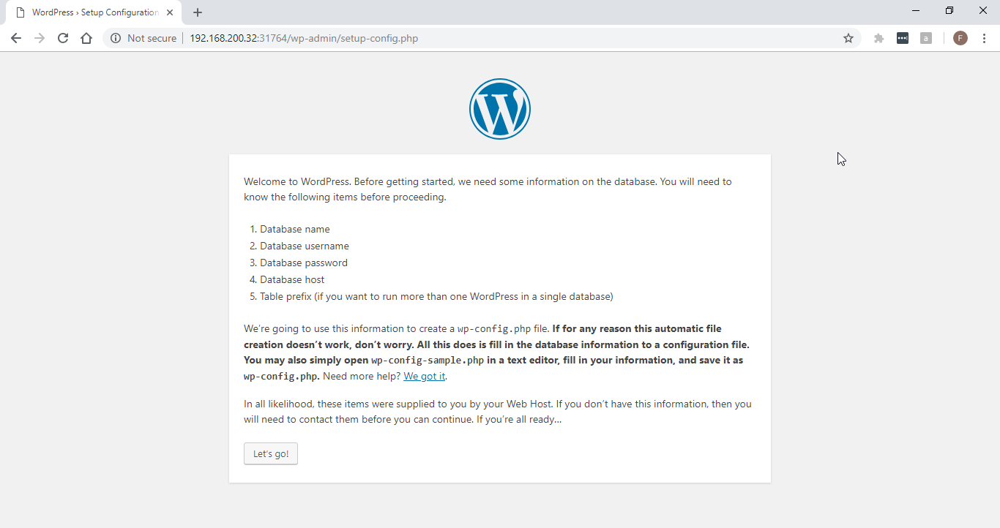

# Build a 2-nodes Kubernetes Cluster
A demo project on how to build Kubernetes cluster and deploy a wordpress app. 

## Prepare nodes

* Nodes design

| Hostname | IP Address | Note|
| ---- | ---- | ---- |
| kube31.fen9.li | 192.168.200.31 |	master node |
| kube32.fen9.li | 192.168.200.32 |	worker node |

* Ensure 2 nodes can ping each other

### Setup docker on 2 nodes
* Install docker and start/enable docker service by running following commands
```
wget https://download.docker.com/linux/centos/docker-ce.repo -O /etc/yum.repos.d/docker-ce.repo
yum -y install docker-ce
systemctl start docker
systemctl enable docker
```

### Prepare nodes for Kubernetes installation
* Disable selinux
```
setenforce 0
sed -i --follow-symlinks 's/SELINUX=enforcing/SELINUX=disabled/g' /etc/sysconfig/selinux
```

* Disable firewalld
```
systemctl stop firewalld
systemctl disable firewalld
```

* Enable net bridge 
```
modprobe br_netfilter
echo 'net.bridge.bridge-nf-call-iptables = 1' >> /etc/sysctl.d/bridge-nf-call.conf
echo 'net.bridge.bridge-nf-call-ip6tables = 1' >> /etc/sysctl.d/bridge-nf-call.conf
```

* Disable swap
```
swapoff -a
sed -i '/swap/d' /etc/fstab
```

### Install Kubernetes

* Create kubernetes repo
```
cat <<EOT > /etc/yum.repos.d/kubernetes.repo
[kubernetes]
name=Kubernetes
baseurl=https://packages.cloud.google.com/yum/repos/kubernetes-el7-x86_64
enabled=1
gpgcheck=1
repo_gpgcheck=1
gpgkey=https://packages.cloud.google.com/yum/doc/yum-key.gpg
       https://packages.cloud.google.com/yum/doc/rpm-package-key.gpg
EOT
```

* Install Kubernetes
```
yum install -y kubelet kubeadm kubectl
systemctl enable kubelet
systemctl reboot
```

## Setup Kubernetes cluster
### On Kubernetes master node
* Initiate cluster
```
kubeadm init --apiserver-advertise-address=192.168.200.31 --pod-network-cidr=10.10.0.0/16
...
mkdir -p $HOME/.kube
sudo cp -i /etc/kubernetes/admin.conf $HOME/.kube/config
sudo chown $(id -u):$(id -g) $HOME/.kube/config
kubectl apply -f https://raw.githubusercontent.com/coreos/flannel/master/Documentation/kube-flannel.yml
```

* Ensure Kubernetes is up and running
```
[fli@kube31 ~]$ kubectl version
Client Version: version.Info{Major:"1", Minor:"11", GitVersion:"v1.11.2", GitCommit:"bb9ffb1654d4a729bb4cec18ff088eacc153c239", GitTreeState:"clean", BuildDate:"2018-08-07T23:17:28Z", GoVersion:"go1.10.3", Compiler:"gc", Platform:"linux/amd64"}
Server Version: version.Info{Major:"1", Minor:"11", GitVersion:"v1.11.2", GitCommit:"bb9ffb1654d4a729bb4cec18ff088eacc153c239", GitTreeState:"clean", BuildDate:"2018-08-07T23:08:19Z", GoVersion:"go1.10.3", Compiler:"gc", Platform:"linux/amd64"}
[fli@kube31 ~]$

[fli@kube31 ~]$ kubectl get nodes
NAME             STATUS    ROLES     AGE       VERSION
kube31.fen9.li   Ready     master    49m       v1.11.2
[fli@kube31 ~]$
``` 

### On Kubernetes worker node
* Join cluster and ensure kubelet service is up
```
sudo kubeadm join 192.168.200.101:6443 --token eam0t9.lb01oj8vt7ms4cja --discovery-token-ca-cert-hash sha256:e41523ead31df5ec4fa69b5616f502e29e9faf53a6dc3265e8f97376d30799cd

[fli@kube32 ~]$ sudo systemctl is-active kubelet
[sudo] password for fli:
active
[fli@kube32 ~]$
```

* Double check on Kubernetes master node
```
[fli@kube31 ~]$ kubectl get nodes
NAME             STATUS    ROLES     AGE       VERSION
kube31.fen9.li   Ready     master    10h       v1.11.2
kube32.fen9.li   Ready     <none>    4m        v1.11.2
[fli@kube31 ~]$

kubectl get all --all-namespaces
```

## Deploy WordPress on this k8s cluster
* Clone this repository to k8s master node
```
git clone -b develop git@github.com:fen9li/k8s-cluster-build.git
cd k8s-cluster-build/
```

* Delete namespace 'wordpress' if it exists
```
kubectl delete ns wordpress
```

* Deploy the wordpress application to k8s cluster
```
kubectl create -f wp-namespace.yaml -f mariadb-deployment.yaml -f mariadb-service.yaml -f wordpress-deployment.yaml -f wordpress-service.yaml
```

* Check resources/objects in namespace wordpress
> Service wordpress TYPE - NodePort
> Port mapped on node - 31764

```
[fli@kube31 k8s-cluster-build]$ kubectl get all -n wordpress
NAME                             READY   STATUS    RESTARTS   AGE
pod/mysql-d7d5db6dd-wl8lm        1/1     Running   0          103s
pod/wordpress-748465d6cf-8gdv7   1/1     Running   0          103s

NAME                TYPE        CLUSTER-IP       EXTERNAL-IP   PORT(S)        AGE
service/mysql       ClusterIP   10.107.247.169   <none>        3306/TCP       104s
service/wordpress   NodePort    10.101.166.40    <none>        80:31764/TCP   101s

NAME                        DESIRED   CURRENT   UP-TO-DATE   AVAILABLE   AGE
deployment.apps/mysql       1         1         1            1           104s
deployment.apps/wordpress   1         1         1            1           104s

NAME                                   DESIRED   CURRENT   READY   AGE
replicaset.apps/mysql-d7d5db6dd        1         1         1       104s
replicaset.apps/wordpress-748465d6cf   1         1         1       104s
[fli@kube31 k8s-cluster-build]$
```

## Check out this new wordpress installation 
* 

*  
> Database Name: wordpress
> Username: root
> Password: aStr0ngPassW0rd
> Database Host: mysql or mysql.wordpress.svc.cluster.local

* 

## Where to go next
* Build more worker nodes and join the cluster
